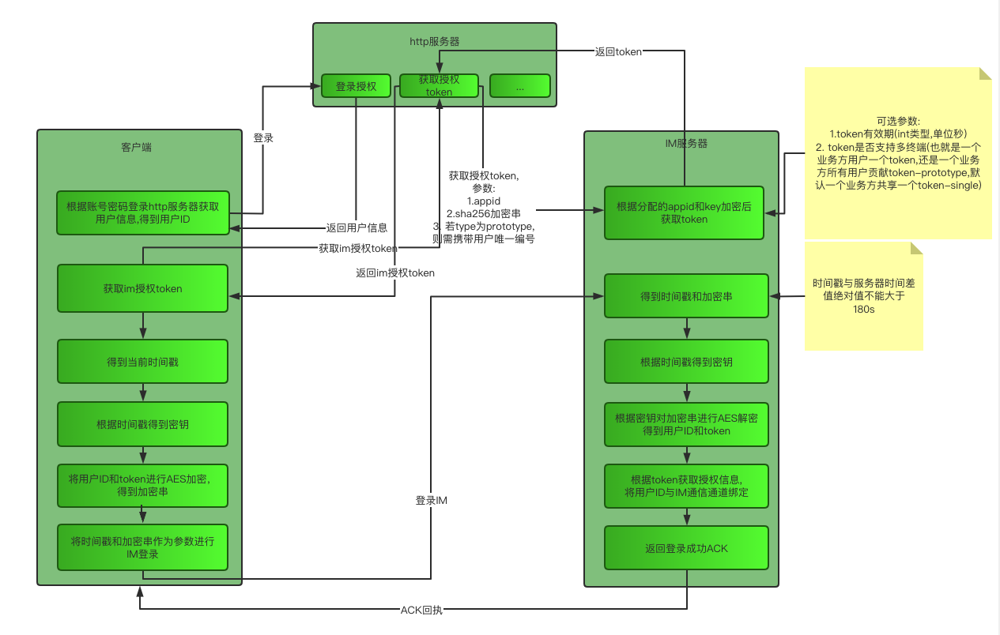
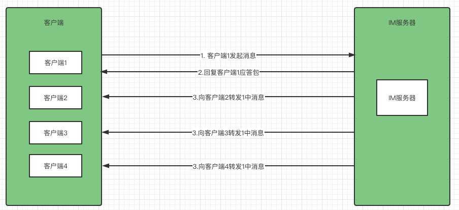
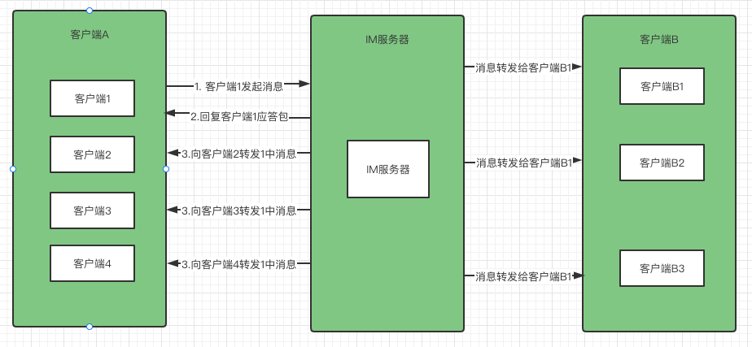

[toc]
#HICOM-IM-SDK简介
##1. 客户端登录签名方式

当客户端登录服务器时,需要携带客户端唯一标志,并对此唯一标志进行签名.服务器对此签名进行验证,验证不合法则登录不成功<br>
####登录流程如下:<br>

1. 完成http接口请求进行登录,得到用户信息,包含唯一ID
2. 通过http服务器获取IM服务器授权token
3. 获取当前时间戳,根据下述运算得到签名字符串
```java
    public static int[] dealKeys = new int[]{
        0x07, 0xB6, 0x79, 0x56, 0x7A, 0x5C, 0x4A, 0xBE, 0x1D, 0xF1, 0xB2, 0x10, 0x3C, 0x5E, 0xDC, 0xA6,
        0x56, 0xE7, 0x88, 0x25, 0x87, 0x95, 0xD5, 0x85, 0x76, 0x7D, 0xEA, 0x66, 0xF5, 0x0A, 0xC3, 0xA8,
        0x55, 0x28, 0x67, 0x14, 0x06, 0xE7, 0xCB, 0x68, 0xAC, 0x2E, 0x00, 0x36, 0x57, 0x2F, 0xD2, 0xE2,
        0x54, 0xE9, 0xC6, 0xA3, 0x03, 0xC6, 0x07, 0x33, 0xBD, 0xF1, 0x6D, 0x46, 0x62, 0xFD, 0x82, 0xCF,
        0xA3, 0x50, 0x15, 0xB2, 0x53, 0xA4, 0x9C, 0x93, 0x98, 0x55, 0x8E, 0xF8, 0xC1, 0x0C, 0x15, 0x71,
        0x42, 0x6A, 0xA4, 0xF1, 0x5D, 0x72, 0xB1, 0xC4, 0xF6, 0xF0, 0x56, 0xAE, 0xCA, 0x77, 0x44, 0x45,
        0x21, 0x1B, 0x93, 0x40, 0x49, 0x89, 0x52, 0x76, 0x2C, 0x64, 0xB8, 0x3B, 0xF9, 0x8D, 0x51, 0xA5,
        0x80, 0x2C, 0x92, 0x39, 0xF7, 0xAD, 0xAF, 0x59, 0x1F, 0x06, 0xDE, 0x5A, 0x1D, 0x91, 0x1C, 0xDB,
        0x6F, 0xAD, 0xC1, 0xE8, 0xE5, 0xD4, 0xB4, 0x7C, 0x3E, 0x61, 0x73, 0x2D, 0xCE, 0xCD, 0x01, 0xDF,
        0x5E, 0xCE, 0x60, 0xB7, 0x83, 0xD1, 0x39, 0xA9, 0xF3, 0x35, 0x05, 0xBA, 0x88, 0x78, 0x97, 0xFC,
        0x3D, 0x2F, 0xF9, 0x36, 0x2A, 0x38, 0xB0, 0x25, 0x16, 0xA7, 0x08, 0x8C, 0xF6, 0x21, 0xC8, 0x22,
        0xBC, 0x90, 0x48, 0x35, 0x9A, 0x0D, 0x1A, 0xD9, 0xFA, 0xCC, 0x70, 0xAA, 0x42, 0x3F, 0xB6, 0xE1,
        0xBB, 0x41, 0x17, 0x74, 0xC2, 0x48, 0x7E, 0x80, 0xD6, 0x09, 0xC5, 0x24, 0x60, 0x30, 0x0E, 0xE3,
        0xFA, 0x92, 0x66, 0x43, 0xE1, 0x8A, 0x4D, 0xD7, 0x1B, 0x6B, 0x23, 0x65, 0xA0, 0x12, 0x9D, 0x9B,
        0xE0, 0x93, 0xE5, 0xD2, 0xE3, 0xF4, 0xDC, 0x41, 0xA4, 0x3A, 0x10, 0x2B, 0x96, 0xED, 0x1B, 0x1E,
        0xA9, 0xB4, 0x34, 0x11, 0x94, 0xA6, 0x75, 0x34, 0xD8, 0x89, 0xFC, 0x4F, 0x3B, 0x22, 0xB1, 0xA7
        };

   
    public static String getSign(long timestamp){
        return Util.MD5(timestamp+"_"+dealKeys[(int)(timestamp%dealKeys.length)]).toUpperCase();
    }
```
3. 使用此签名串对1中ID和2中token进行AES加密,加密方式如下:
```java
/**
     * AES加密
     * @param data 需要加密的数据
     * @param key  加解密的对称密钥
     * @return 加密字符串 加密失败返回null
     */
    public static String encrypt_AES(String data,String key){
        if(Util.isNullOrEmpty(data)||Util.isNullOrEmpty(key)){
            return null;
        }
        try{
            Util.assertionIsFalse(key.length()!=32,"加密失败,密钥长度须32位.");
            byte[] raw = key.getBytes("utf-8");
            SecretKeySpec keySpec = new SecretKeySpec(raw, "AES");
            Cipher cipher = Cipher.getInstance("AES/ECB/PKCS5Padding");//"算法/模式/补码方式"
            cipher.init(Cipher.ENCRYPT_MODE, keySpec);
            return Base64.getEncoder().encodeToString(cipher.doFinal(data.getBytes("utf-8")));
        }catch (Exception e){
            e.printStackTrace();
        }
        return null;
    }
```
4. 将时间戳和加密串放入参数传入im服务器进行登录
##2. SDK多终端,多协议与单终端多协议自由切换
多终端多协议: 可以使用任意终端,任意设备登录同一账号,账号消息不同设备之间同步，此模式在客户端登录im时,需传递设备号参数,
避免同设备重复登录

单终端多协议: 仅支持不同协议登录同一账号,如app使用tcp,pc使用udp,web使用ws，利用协议区分终端类型来模仿类似微信效果

消息转发流程,模拟用户A发给用户B--发送者信息同步流程：



通过上述流程，多设备间可同步自己发送的消息。用户A发送"你好",登录当前用户的其他设备能够同步看见此消息。并且应答包和客户端2、3、4的同步消息都将加入QOS策略,避免消息丢失和重复

消息转发流程,模拟用户A发给用户B--发送与接收流程：同理转发给客户端B的消息也将加入QOS策略,避免丢失或重复，丢入Qos将记录消息体和发送目标,同用户不同客户端之间Qos内容独立不一致



##3. 兼容多消息类型
支持文本、图片、语音、短视频、文件、表情、名片、位置、合并消息、@功能等消息类型。 但其实消息类型并不需要服务器进行维护，而是由客户端维护解析，服务器需要做的事情仅仅只是转发而已
##4. 支持单聊/群聊
SDK仅提供一个消息前置函数,供业务层调用，对于SDK来说，无论单聊群聊,转发目标都是1-N个发送目标,并且再去获取发送目标的多个终端进行转发,所以单聊/群聊可以合并到一个功能中,仅提供不同type供业务层区分此消息是单聊还是群聊即可
##5. 支持临时聊天/好友聊天
此功能也是业务层功能,在4中前置函数中业务层处理,SDK本身并不做此处理.如果不需要好友聊天,函数返回转发目标集合即可,若需要且发送目标又不是发送者好友,返回空集合即可,空集合将不会处理后续逻辑
##6. 服务/事件通知
通过事件机制，将SDK功能和业务代码分离，SDK只关心消息转发并不需要关注业务具体实现
具体事件和业务服务函数如下：
```java
public interface LogicProcess {
    /**
     * type-1 单聊 type-8 群聊
     * 根据to获取要转发的目标群体
     * 得到的结果可以是好友id/获取在同一个群的所有用户id
     */
    List<String> getTargets(Protocol protocol);

    /**
     * 将消息存到数据库
     */
    void addMessage(Protocol protocol);

    /**
     * 长连接的登录请求前置方法,如果返回false 则不会执行长连接登录功能
     * 可以用来做账号密码验证,签名验证等
     * 当然也可以将登录请求独立到http接口去,这也是本框架推荐的做法,而这个方法需要做的仅仅是验签即可
     */
    boolean loginBefore(Channel channel,Protocol protocol);

    /**
     * 长连接的退出登录请求前置方法,如果返回false 则不会执行长连接登出功能
     * 可以用来做销毁登录session或者token等操作
     * 当然也可以将退出登录请求独立到http接口,闲置此方法即可 但需要返回true 让长连接登出功能得以继续
     * 如果需要抛错到长连接  调用#ProtocolManager.sendAck(Channel,dataContent,type-ChannelConst中的消息协议类型);
     */
    boolean logoutBefore(Channel channel,Protocol protocol);

    /**
     * 服务器接收到通用消息的前置方法 返回false 则直接阻断长连接后续功能 比如转发消息/qos/回调  都不再执行 直接砍断
     * 目前未想到此方法的作用，留作一些个性化业务吧 默认返回true即可
     */
    boolean sendMsgBefore(Channel channel,Protocol protocol);

    /**
     * TODO... 这里需要做到一个用户多个客户端的情况,需要全部失败才算失败,目前仅做到一个失败就回调一次,需要迭代
     * qos失败的回调
     * 这个方法是真正意义上的失败,也就是对方离线或qos过程中离线
     * 此方法适合用来做离线消息
     * 每条消息,每个接收者支触发一次
     * @param channelId 客户端唯一标志,这个标志可用于记录当前离线消息属于谁的
     * @param protocol 消息体
     */
    void sendFailCallBack(String channelId,Protocol protocol);

    /**
     * 消息真正意义上的发送成功回调 目标客户端收到并回执给服务器算真正意义的成功
     * 每条消息,每个接收者只触发一次
     */
    void sendSuccessCallBack(Protocol protocol);
    /**
     * 发送数据的回调
     * 发送了一次数据的回调(成功则成功,失败则会走qos),并不意味着成功或者失败。这里仅代表发送了,但是客户端是否已收到并不知道,需要在#sendFailCallBack和#sendSuccessCallBack中才能知道
     * 每条消息,每个接收者只触发一次
     * TODO...udp协议无法监听成功与失败(虽然这里无需成功和失败的状态,但是还需要再次测试udp是否能监听到发送成功)
     */
    void sendCallBack(Object protocol);
    /**
     * 自定义协议类型的处理方法 可扩展框架协议外的其他自定义类型协议
     * @param channel 客户端消息通道
     * @param protocol 消息体
     */
    void customProtocolHandler(Channel channel,Protocol protocol);

    /**
     * 客户端掉线
     */
    void sessionClosed(String channelId, Channel channel);

    /**
     * 客户端是否超时
     * @return true-如果链接登录过 则会关闭并踢掉此链接 并触发sessionClosed事件 false-不会
     */
    boolean channelTimeout(String channelId, Channel channel);
}
```
##7. QOS策略
SDK支持QOS防丢防重策略，具体实现流程如下：
1. 客户端A发送消息"hello"到服务器,目标是发送给B
2. 判断此消息是否已存在(消息存在一个唯一编号),存在直接回复3中的ACK包，结束
3. 服务器收到消息后,生成一个回执包发送给客户端A,告知服务器已收到消息
4. 将3中生成的ACK丢入QOS队列,等待客户端A的回执进行删除。这里要把回执放入QOS的目的是防止客户端消息重复，就是步骤2所做的事
5. 将消息克隆后重新设置一个唯一消息编号，加入QOS，并发送给客户端B，等待客户端B回执并删除
6. 定时将QOS队列中消息推送指定目标，若用户回执则删除对于消息包，否则一直推送，直到用户离线为止
```java
/**
 * 统一的消息转发
 */
public static void sendMsg(Channel channel, Protocol protocol){
    //开启了qos 客户端需要一个回执
    if(protocol.getAck()==100){
        //聊天消息必须携带一个消息ID 如果没有就回执报错
        if(!Util.isNotEmpty(protocol.getId())){
        ProtocolManager.sendAck(channel,ChannelConst.CHANNEL_MESSAGE_NO_ID);
            return;
        }
        //先给发送方一个消息回执，代表服务器收到了消息
        ProtocolManager.sendAck(channel,protocol,ChannelConst.CHANNEL_ACK);
        //判断是否已经存在待发送消息
        //判断这条消息是否已存在，如果已存在不做任何处理，否则会出现消息重复
        if(msgs.contains(protocol.getId())){
            return;
        }
        /**
         * 当消息不存在的时候 将当前消息作为当前客户端的待发消息进行存储，等待回执删除
         * 这里需要启动消息补偿机制，只需要将消息存入待转发消息集合就行
         * 但是这里的设计是：
         * 1。 对于发送着来说，会将发送者携带的消息编号存入集合 作为带转发消息（其实已经发了，只是需要等到客户端回执才会清除这个消息）而服务器会
         *     给客户端进行回执，告诉客户端服务器已经收到了你的消息，但是客户端还需要给服务器一个回执，让服务器清除这个待发送消息 形成完整闭环
         *     而客户端回执的这个消息又会与 需转发客户端的回执一样，服务器也就采用同样的处理，进行消息删除
         * 2。 对于需转发客户端来说，消息编号会新生成一个，与接收到的不同，而且不同的客户端生成不同的消息编号，与客户端对应
         */
        msgs.put(protocol.getId(),new MsgDTO(Util.getChannelId(channel),protocol));
    }
    /**
     * 不管是否在线 而且不管是否转发成功  都需要  --存到消息记录中
     * 这里不在回调函数中执行 是因为在回调中可能被执行多次 这样会导致添加消息的方法会被调用多次
     * 而回调函数一般用来做离线消息存储 或push推送等
     */
    ChannelConst.LOGIC_PROCESS.addMessage(protocol);
    //------------------------处理转发逻辑-----------------
    //利用线程池加速
    ThreadManager.getInstance().execute(()-> {
        //通过业务处理器获取多个目标并转发和qos
        ChannelConst.LOGIC_PROCESS.getTargets(protocol).forEach(target -> {
            sendMsg(target, protocol);
        });
    });
}
/**
 * 提供内外皆可调用的通用方法
 * 此方法会开启qos和结果回调
 */
public static void sendMsg(String channelId, Protocol protocol){
    //判断目标是否在线 而且不是自己 自己不能给自己发消息
    if(ChannelHandler.getInstance().isOnline(channelId)&&!channelId.equals(protocol.getFrom())){
        //客户端要求启用qos机制才启用 ack==100
        if(protocol.getAck()==100){
            //将待转发消息存起来 给每个客户端对应当前消息生成一个唯一消息编号
            String new_msg_no = Util.getRandomStr();
            //将新的消息编号设置到消息中，替换原来的消息编号  原来的消息编号只与发送它的客户端对应
            protocol.setId(new_msg_no);
            msgs.put(new_msg_no,new MsgDTO(channelId,protocol));
        }
        //获取优先级最高的协议
        Channel realChannel = ChannelHandler.getInstance().getChannelUDPFirst(channelId);
        /** 直接发送 这里如果发送失败，会有补偿机制去做重发
         *  成功不需要做什么操作
         *  如果客户端收到ack为100的此条消息 客户端需要给服务器回执,不然服务器的qos队列消息不会删除
         */
        send(realChannel, protocol);
        return;
    }
    //对方客户端不在线 则直接调用失败回调函数通知
    ChannelConst.LOGIC_PROCESS.sendFailCallBack(channelId,protocol);
}
/**
 * 原生定时器实现qos每间隔指定时间进行第N次发送,一直到qos中删除这个包或用户端掉线
 * 这里与主线程并行，所以可能会出现：主线程发送了消息后,qos立马又发送了一条，
 * 且间隔未达到ChannelConst.QOS_DELAY指定间隔,所以通过preSendTimeStamp字段来排除这种情况
 * 以保证qos的消息，至少间隔ChannelConst.QOS_DELAY指定时间发送
 *
 * 当前设计中并没有限制qos发送次数,也就是如果用户端未返回ack,那么这个消息包会一直间隔发送
 * 这里为什么不对发送次数进行限制的原因是：用户端弱网，但并没有掉线/断线 如果达到次数限制，记录为离线消息。
 * 但是用户端并掉线/断线，从而没有触发重连机制，就导致这个这次消息不会实时更新到用户端，虽然消息被记录为离线消息。
 * 但是用户端不会触发去拉去离线消息机制，如果等到用户下一次上线或下一次拉取离线时，这条消息已经被后面的新消息顶到看不见了....
 */
new Timer().schedule(new TimerTask() {
    public void run() {
        //获取待发消息集合的迭代器
        Iterator<MsgDTO> iterator = msgs.values().iterator();
        while (iterator.hasNext()){
            MsgDTO msgDTO = iterator.next();
            //如果在线就发送待发消息
            if(ChannelHandler.getInstance().isOnline(msgDTO.getChannelId())){
                //当前发送时间必须比上次发送时间至少间隔ChannelConst.QOS_DELAY
                long cur_timestamp = System.currentTimeMillis();
                if(System.currentTimeMillis()-msgDTO.getPreSendTimeStamp()<ChannelConst.QOS_DELAY){
                    continue;
                }
                Channel realChannel = ChannelHandler.getInstance().getChannelUDPFirst(msgDTO.getChannelId());
                //记录当前发送时间
                msgDTO.setPreSendTimeStamp(cur_timestamp);
                baseSend(realChannel, msgDTO.getProtocol());
            }else{
                //如果不在线  就将当前待发消息直接删除
                msgs.remove(msgDTO.getProtocol().getId());
                //qos是在线才会触发 这里不在线代表 之前在线 后来不在线了 算是失败了 提供回调到业务层
                ChannelConst.LOGIC_PROCESS.sendFailCallBack(msgDTO.getChannelId(),msgDTO.getProtocol());
            }
        }
    }
},500,ChannelConst.QOS_DELAY);
```


